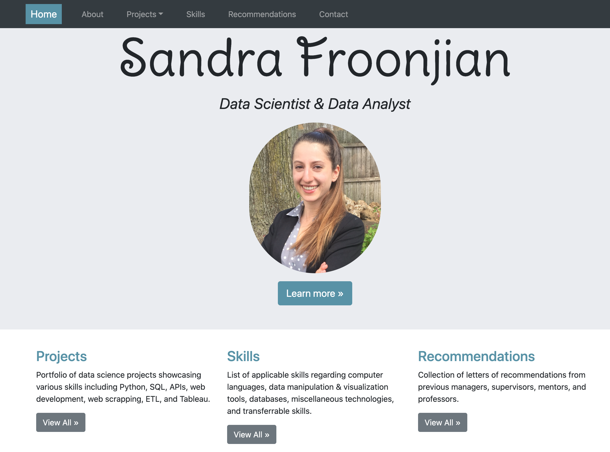
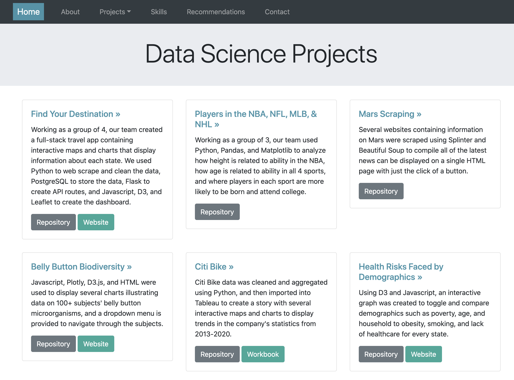

### Purpose of this project:
The purpose of this project is to create my own website to 1) display my web development skills and 2) showcase all of projects and information in one neat and cohesive place. Users have the opportunity to view overviews of each of my projects, with links to their repository and webpage (if applicable). They can also view all of my technical and soft skills, letters of recommendation, and my contact information.

---

### How to run the code:
Go to the link [https://sfroonjian.github.io/Portfolio/](https://sfroonjian.github.io/Portfolio/) to view the website.

---

### Data collected:

